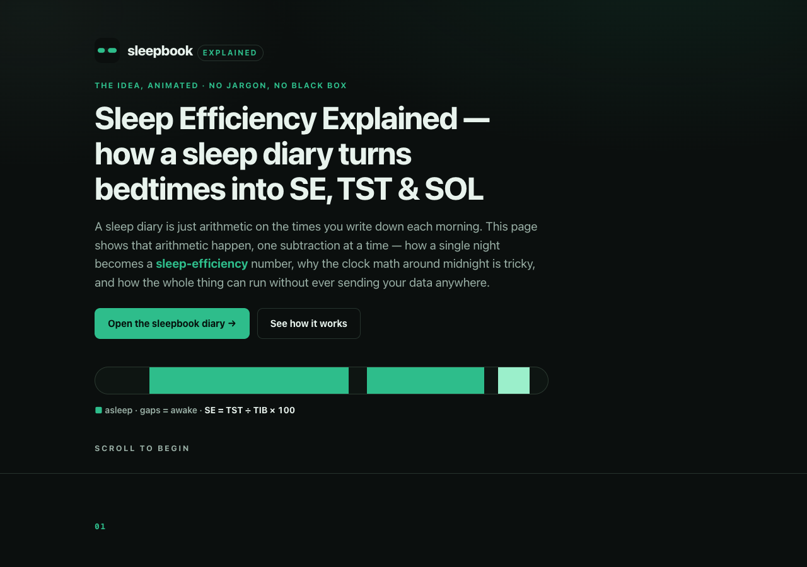

# sleepbook · explained

**An animated explainer of how a sleep diary computes sleep efficiency.** A single, scroll-driven
page that shows the arithmetic behind a CBT-I morning sleep diary — how one night becomes a
**sleep-efficiency** number, why the clock math around midnight is tricky, and how the whole thing
can run without ever sending your data anywhere. Built with plain HTML, CSS, and a little vanilla
JavaScript: no framework, no build step, no dependencies, and no network calls at all.

> This is the explainer. The tool it describes is **sleepbook** — a working, printable sleep diary:
> **[open the sleepbook app &rarr;](https://sreenivas-sadhu-prabhakara.github.io/sleepbook/)**

## Why

If you search "sleep diary template", you get a static printable you still have to do the maths on
yourself, every morning, for weeks. The arithmetic isn't hard — it's fiddly, repetitive, and easy to
get wrong, especially the part that crosses midnight. This page exists to make that arithmetic
*visible*: to show, step by step, exactly how a sleep diary turns the times you write down into
sleep-onset latency (SOL), total sleep time (TST), and sleep efficiency (SE) — so the number in the
tool is never a black box.

It's also a demonstration of an honest privacy model. Sleep is health data. Rather than promise not
to misuse it, the app it describes ships a security policy that makes uploading it *physically
impossible* — and this page explains how one line does that.

## What it covers

1. **The problem** — why static sleep-diary printables leave you doing the maths.
2. **The motif** — one night drawn as a strip: jade for asleep, ink gaps for awake.
3. **The formula, built** — every subtraction from time-in-bed down to total sleep time, then
   `SE = TST ÷ TIB × 100`, worked through on a real-ish night to **77.2%**.
4. **The midnight trap** — why the clock reads backwards across midnight, and how a correct diary
   adds a full day (1440 min) instead of showing a negative.
5. **The privacy guarantee** — how `connect-src 'none'` makes "your data never leaves the page" an
   enforced fact, not a promise.
6. **A short feature tour** of the sleepbook diary itself.
7. **A call to action** linking to the live app.

## The animation, honestly

The narrative is driven by CSS transitions and a small `IntersectionObserver` in `app.js` that marks
each section as it scrolls into view (revealing text and drawing the night strips in). There is a
thin progress rail at the top and a single number that counts up to the worked sleep-efficiency
figure. That's the whole of the JavaScript — it is pure progressive enhancement:

- With **JavaScript disabled**, every section is fully visible and readable.
- With **`prefers-reduced-motion: reduce`**, all transitions and keyframes are switched off and every
  animated element renders in its finished, legible end state.
- The page is keyboard-operable, has a skip link, and meets WCAG-AA contrast in both light and dark.

No chart library, no animation library, no fonts, no trackers.

## Quickstart

Just open `index.html` in any modern browser — no build step, no server, no install.

- **Local:** double-click `index.html`, or run a static server in the folder.
- **Hosted:** **[Open the explainer live](https://sreenivas-sadhu-prabhakara.github.io/sleepbook-explained/)**

## Privacy

This explainer is built to the same private-by-construction rules as the app it describes.

- A strict Content-Security-Policy sets `connect-src 'none'`: the page **cannot** make any network
  request even if it tried.
- No external fonts, scripts, images, or analytics. Everything is self-contained and same-origin.
- There is no service worker, no account, no cloud, and no tracking of any kind.

## Disclaimer

sleepbook · explained is an **educational explainer** of how a sleep diary computes sleep efficiency,
total sleep time, and sleep-onset latency. It is **not medical advice, diagnosis, or treatment**, and
it is not a medical device. Sleep efficiency is shown as the published standard
`SE = total sleep time ÷ time in bed × 100`; it is not interpreted against any clinical threshold.
CBT-I for insomnia should be guided by a qualified clinician, and symptoms such as loud snoring,
gasping, or breathing pauses are reasons to see one regardless of any diary. This software is provided
under the MIT License, "as is", without warranty of any kind; the author accepts no liability for any
loss, injury, or damage arising from its use.

## License

[MIT](./LICENSE) © 2026 Sreenivas Sadhu Prabhakara
